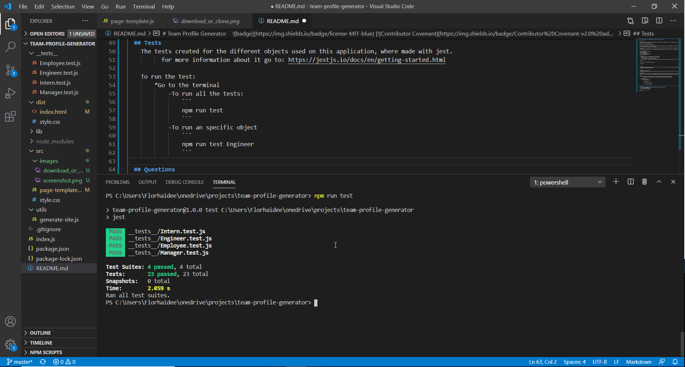

# Team Profile Generator     [](code_of_conduct.md)

  ## Description 

  A Node.js Command-Line application that takes in information about employees on a software engineering team and generates an HTML web-page that displays summaries for each person. 

  

  The HTML file generated by the command-line applicattion will display 3 types of team members: manager, engineer and intern. 
  On each card shows their name, id, email address.
  
    * If you click on the email address, is going to open and display the default email program and populates the TO field of the email address selected.
    * For the member type engineer is also displaying their gitHub username. If you click on it, that GitHub profile opens in a new tab.

  ## Table of Contents 
  * [Installation](#installation)
  * [Usage](#usage)
  * [License](#license)
  * [Contributing](#contributing)
  * [Tests](#tests)
  * [Questions](#questions)
  
  ## Installation
    1. Download or clone this repository on your computer.


    2. Install node.js 
             go to 
https://nodejs.org/es/download/

    3. Open your editor and type the following command into your terminal, once you've navigated to the root directory of the project
    ```
    npm init
    ```
    4. Install all the dependencies using npm
    ```
    npm install
    ```


  ## Usage
    To know how to use this application, click on the video below.

[](https://drive.google.com/file/d/1XVt1sYjq2d_JKb7bj82JkY71Y2SWClbe/view)


  ## License
    Copyright © 2020 florhaidee. 
    Licensed under the MIT to see more about this license you can find it on the file 'license.txt' go to
[MIT-license](./src/MIT-license.txt) 

  ## Contributing 
    Please note that this project is released with a Contributor Code of Conduct. By participating in this project you agree to abide by its terms.
    Visit [Code of Conduct](https://www.contributor-covenant.org/version/2/0/code_of_conduct/) to have more information.
  
  ## Tests
    The tests created for the different objects used on this application, where made with jest. 
          for more information about it go to: 
https://jestjs.io/docs/en/getting-started.html

    To run the test:
        *Go to the terminal
            -To run all the tests:
                ```
                npm run test
                ```

            
            -To run an specific object
                ```
                npm run test manager
                ```            
   


  ## Questions
    If you have more questions about this application, you can contact me by:
      email: florhaideeg@gmail.com
      GitHub username: florhaidee

  ## Made with ❤️ by florhaidee
  ## ©️2020 


